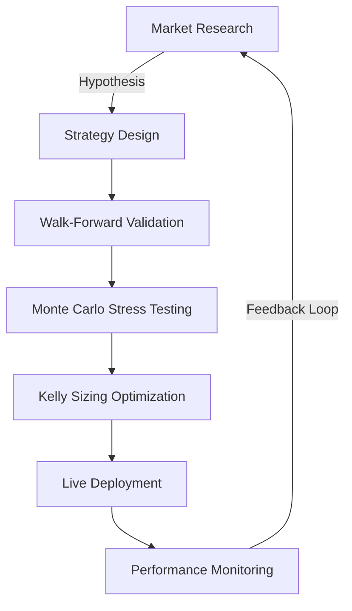
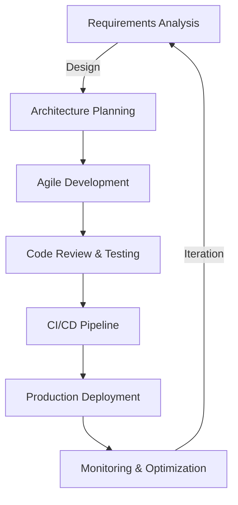

<!-- Animated Ocean Header with Blue Theme -->
<div align="center" style="background: linear-gradient(135deg, #667eea 0%, #764ba2 25%, #6B8DD6 50%, #8E37D7 75%, #667eea 100%);">
  
</div>

<!-- Animated Fish Background -->
<p align="center">
  
</p>

<!-- Animated Blue Wave Divider -->
<p align="center">
  
</p>

<div align="center">

### ⚓ **Software Engineering Student · Quant Trading Navigator** ⚓


<!-- Animated Fish Swimming -->
<p align="center">
  
</p>

<br/>

<!-- Social Links with Ocean Theme -->
<a href="mailto:mert.yigitkoc03@gmail.com">
  
</a>
<a href="https://www.linkedin.com/in/mert-ko%C3%A7yi%C4%9Fit-394044240/">
  
</a>
<a href="https://www.orneksite.com">
  
</a>

<br/><br/>

<!-- Visitor Badge & Stats -->


</div>

---

<!-- Ocean Themed Background -->
<div align="center">
  
</div>

## 🧭 **Captain's Log**


### 🌊 **Navigating the Digital Seas**

Welcome aboard! I'm a **Software Engineering student** and **Full-Stack Developer** who transforms ideas into reality through code. Like a seasoned captain navigating multiple oceans, I master various programming languages and technologies.

**📅 Current Mission Status:**
- 📍 **Location:** İzmir, Turkey 🇹🇷
- 🎓 **Rank:** Software Engineering Student
- 💼 **Specialization:** Full-Stack Development & Quantitative Trading
- 🔄 **Active Hours:** Coding by day, Trading by night
- 📊 **Domains:** System Programming, Algorithmic Trading

**⚓ Development Arsenal:**
- 🔥 **Java Development** - Enterprise applications with Spring Boot, building robust backend systems
- 🎯 **C++ Programming** - High-performance computing, system-level programming, and algorithm optimization
- 🌐 **PHP & Web Technologies** - Dynamic web applications, RESTful APIs, Laravel framework
- 🐍 **Python Mastery** - Data science, automation, ML models, and trading algorithms
- 🎨 **Frontend Magic** - Responsive design with modern CSS frameworks
- 🗄️ **Database Architecture** - MySQL, PostgreSQL, MongoDB, Redis for scalable solutions

**🚢 My Trading Fleet:**
- 🏴‍☠️ **Data Ingestion & Feature Engineering** - Mining the depths for alpha
- ⚓ **Backtesting & Walk-Forward Analysis** - Testing in all weather conditions
- 🧭 **Monte Carlo Risk Simulations** - Preparing for the perfect storm
- 🎯 **Kelly-Criterion Position Sizing** - Optimal cargo loading
- 🤖 **MT5/Binance API Automation** - Autopilot trading systems

**📍 Current Coordinates:**
- 💻 Building scalable **Java microservices** with Spring Cloud
- ⚡ Optimizing **C++ algorithms** for HFT (High-Frequency Trading)
- 🌐 Developing **PHP e-commerce platforms** with payment integrations
- 🦈 Shipping **Bot718** - Advanced algorithmic trading system
- 🐙 Deploying **ICT Venom** - Automated market structure model
- 🔱 Creating a tech empire, one commit at a time

---

<!-- Ocean Wave Separator -->
<div align="center">
  
</div>

## ⚓ **Tech Arsenal**

<div align="center">

### 🏴‍☠️ **Primary Weapons**


### 🗺️ **Navigation Tools**


### 🔧 **Support Crew**


</div>

---

<!-- Ocean Wave Divider -->
<div align="center">
  
</div>

## 📊 **Performance Metrics**

<div align="center">

### 🌊 **Trading Statistics**


### 🐋 **Language Distribution**


### 🦈 **Activity Wave**


</div>

---

<!-- Ocean Wave Animation -->
<div align="center">
  
</div>

## 🧭 **Navigation Philosophy**

<div align="center">
<table>
<tr>
<td width="50%">

### 🌊 **Trading Approach**


</td>
<td width="50%">

### 💻 **Development Methodology**


</td>
</tr>
</table>
</div>

### ⚓ **Core Principles**

<div align="center">
<table>
<tr>
<td width="33%">

#### 🎯 **Technical Excellence**
- **Clean Architecture**: SOLID principles, Design Patterns
- **Performance First**: Optimized algorithms, efficient data structures
- **Scalability**: Microservices, distributed systems
- **Security**: Encryption, secure coding practices

</td>
<td width="33%">

#### 🚀 **Project Leadership**
- **Team Collaboration**: Code reviews, pair programming
- **Agile Methodology**: Scrum master experience
- **Documentation**: Technical specs, API docs
- **Mentorship**: Junior developer guidance

</td>
<td width="33%">

#### 📊 **Business Impact**
- **Problem Solving**: Transform ideas into solutions
- **ROI Focus**: Measurable business value
- **User-Centric**: UX/UI best practices
- **Innovation**: Research & implement cutting-edge tech

</td>
</tr>
</table>
</div>

### 🔱 **My Development Journey**

```yaml
Trading Systems:
  - Role: "Lead Algorithm Developer"
  - Impact: "40% reduction in drawdown through risk optimization"
  - Stack: "Python, C++, Pine Script"
  
Enterprise Applications:
  - Role: "Full-Stack Architect"
  - Impact: "3x performance improvement in legacy systems"
  - Stack: "Java Spring Boot, MySQL, Redis"

Web Platforms:
  - Role: "Backend Lead Developer"
  - Impact: "Handled 100K+ concurrent users"
  - Stack: "PHP Laravel, PostgreSQL, Docker"
```

### 🌊 **Philosophy in Action**

> **"Code like a craftsman, trade like a scientist, lead like a captain"**

- **🔍 Research-Driven**: Every decision backed by data and analysis
- **🔄 Continuous Learning**: Stay ahead with emerging technologies
- **🤝 Open Source Contributor**: Give back to the community
- **📈 Growth Mindset**: Every bug is a learning opportunity
- **⚡ Efficiency Obsessed**: If it can be automated, it will be automated

---

<!-- Ocean Wave Divider -->
<div align="center">
  
</div>

## 🚢 **Captain's Coordinates**

<div align="center">

### 📡 **Send a Signal**

<a href="mailto:mert.yigitkoc03@gmail.com">
  
</a>

<br/>

<a href="https://www.linkedin.com/in/mert-ko%C3%A7yi%C4%9Fit-394044240/">
  
</a>

<br/>

<a href="https://www.orneksite.com">
  
</a>

</div>

---

<div align="center">

### ⚠️ **Maritime Law**

> *All trading strategies and code are for educational purposes only.*  
> *Past performance does not guarantee future results.*  
> *Always practice proper risk management.*  
> *Not financial advice - sail at your own risk!*

</div>

---

<!-- Animated Ocean Footer with Blue Theme -->
<p align="center">
  
</p>

<!-- Hidden Anchor -->
<div align="center">
  <br/>
  
  <br/>
  <sub>⚓ Thanks for diving deep into my profile! ⚓</sub>
</div>
